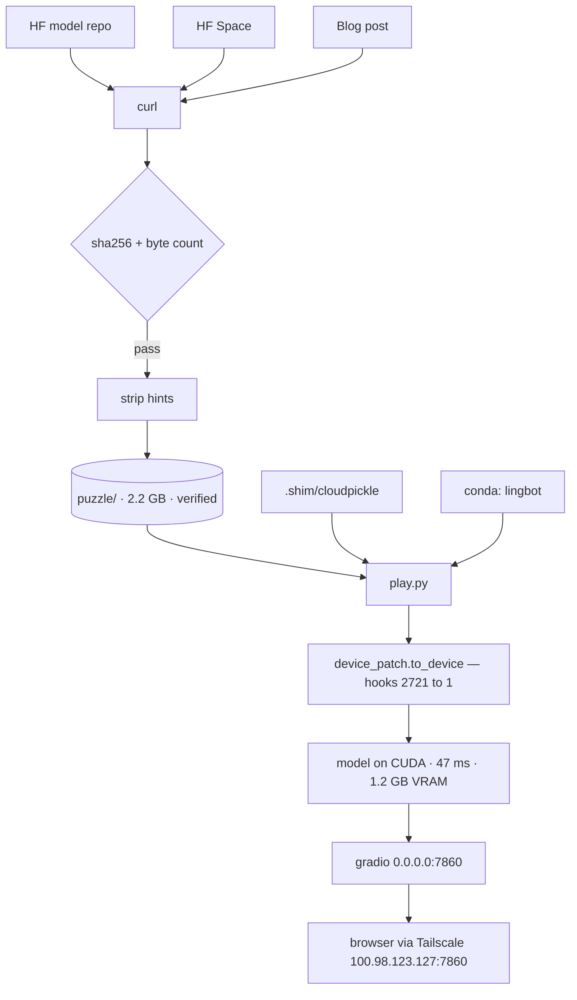

# Jane Street neural-net puzzle — setup notes

Goal: reverse-engineer the model **blind**. The authors embedded hints in the
original `app.py`; the setup script stripped them, and has since been deleted
because it held the answer in plaintext. See [Spoiler hygiene](#spoiler-hygiene)
before opening anything linked here.

---

## Schematic

### Acquisition — one-time, already complete

```
 SOURCES
   huggingface.co/jane-street/2025-03-10 ......  model.pt · model_3_11.pt · README
   huggingface.co/spaces/jane-street/puzzle ...  app.py · requirements.txt · README
   blog.janestreet.com/can-you-reverse-...  ...  puzzle.png
                          │
                          │  curl   large: -C - resume  ·  small: atomic .tmp + mv
                          ▼
                ┌──────────────────────┐
                │  VERIFY              │   sha256 + exact byte count
                └──────────┬───────────┘   both models PASS
                           ▼
                ┌──────────────────────┐
                │  STRIP HINTS         │   app.py  value='…' → value=''
                └──────────┬───────────┘   + hint sentence removed
                           ▼                 (script since DELETED — held the
                    puzzle/  2.2 GB           answer in plaintext)
```

### Runtime — what happens on every request

```
   puzzle/model_3_11.pt ──┐
                          │   torch.load(..., weights_only=False)
   .shim/cloudpickle ─────┤   └─ REQUIRED to unpickle. Vendored copy, so no
                          │      conda env was modified.
   conda env: lingbot ────┘   py3.11.14 · torch 2.10 · gradio 6.8
          │
          ▼
      play.py
          │   device_patch.to_device(model, 'cuda')
          │     ├─ pre-hook moves inputs to each module's param device
          │     ├─ calibrate → prune hooks  2721 → 1
          │     └─ TF32 off  → bit-exact vs CPU (max diff 0)
          ▼
   model on CUDA    47 ms/call · 1.2 GB VRAM · 2.14× CPU
          │         launch-bound, NOT compute-bound — see §3c
          ▼
   gradio  0.0.0.0:7860    tabs: [ Single | Batch ]
```

### Access — box is headless-over-SSH, browser is elsewhere

```
   your browser                      this box  (skr-B650M-Pro-RS-WiFi)
   ─────────────────────────         ──────────────────────────────────
   100.98.123.127:7860   ──── Tailscale ─────►  0.0.0.0:7860    ← current
   127.0.0.1:7860        ──── ssh -L 7860 ────►  127.0.0.1:7860  needs tunnel
   127.0.0.1:7860        ──── VSCode PORTS ───►  127.0.0.1:7860  needs forward
```

<details><summary>Same flow as mermaid (renders in preview / GitHub)</summary>



</details>

---

## envs

Verified working — each was tested by actually loading the model and running a
forward pass, not just by comparing version numbers.

| Env | Python | torch | cloudpickle | Use with |
|---|---|---|---|---|
| `/media/skr/storage/conda_envs/iws` | 3.11.15 | 2.12.1+cu130 | 3.1.2 | `model_3_11.pt` |
| `/media/skr/storage/conda_envs/omnigibson-venv` | 3.10.16 | 2.7.0+cu128 | 3.1.2 | `model.pt` |

```bash
/media/skr/storage/conda_envs/iws/bin/python
# torch.load("puzzle/model_3_11.pt", weights_only=False, map_location="cpu")
```

**`cloudpickle` is the load-bearing dependency, not torch.** The `.pt` files are
whole pickled objects (`torch.load(..., weights_only=False)`), not state dicts,
so `torch.load` imports `cloudpickle` during unpickling and raises
`ModuleNotFoundError` without it. Because cloudpickle bakes in version-specific
bytecode, the interpreter's minor version must match the file variant — hence
Jane Street shipping two files. Python 3.11+ → `model_3_11.pt`, else `model.pt`.

Envs that have torch **and** gradio but **not** cloudpickle (`lingbot`,
`egox-egoprior`) fail to load the model until cloudpickle is on the path. That is
what `.shim/` exists to solve.

The box has an RTX PRO 4000 Blackwell (sm_120, 24 GB). Torch in `iws` includes
sm_120 so CUDA works, but the model is small enough that CPU is fine and the
playground runs on CPU deliberately.

---

## Setup

### 1. Download — `setup_puzzle.sh` *(since deleted)*

The script pulled from the original sources, verified, then stripped the hints.
**It has been deleted**: its strip step necessarily contained the answer in
plaintext, which defeated the point of stripping. The downloads are already
complete and verified, so it is no longer needed — and the table below plus the
checksums in §2 are enough to reconstruct it if ever required.

| Source | What |
|---|---|
| `huggingface.co/jane-street/2025-03-10` | `model.pt`, `model_3_11.pt`, README |
| `huggingface.co/spaces/jane-street/puzzle` | `app.py`, `requirements.txt`, README |
| `blog.janestreet.com/can-you-reverse-engineer-our-neural-network/` | `puzzle.png` |

It was re-runnable: completed large files were skipped, interrupted ones resumed,
small files always refetched and written atomically via `.tmp` + `mv`.

### 2. Verification

Both hashes were recomputed independently after download, not just read from the
script's own log. Both match on hash **and** exact byte count:

| File | Bytes | SHA256 |
|---|---|---|
| `model.pt` | 1,158,692,162 | `1ff10e21b54431a0959d8d6827d670fe122490c041ac234627fd37f44d825913` |
| `model_3_11.pt` | 1,158,729,818 | `43aa7da7ccf749ae1fb95f8b7a6aa49536b73e27f0ac74cb90d5f824ccd484b2` |

Also confirmed: no leftover `.tmp` fragments, `puzzle.png` decodes as a valid
2385×1485 PNG, and `puzzle/app.py` line 32 reads `value=''` with none of the
hint strings present.

### 3. Model facts (non-spoiler)

`Sequential`, **288,998,553 parameters**, takes a string and returns a float.
Loads in well under a second from page cache. Deterministic across repeated
calls. Every input tried so far returns `0.0` — this is *not* a broken load;
activations were confirmed input-dependent through the overwhelming majority of
the network, so the constant output is the model behaving as designed.

### 3a. GPU — `device_patch.py`

**Now runs on CUDA by default.** A bare `model.cuda()` does *not* work:

```
RuntimeError: Expected all tensors to be on the same device,
but got mat1 is on cpu, different from other tensors on cuda:0
```

`.cuda()` moves *parameters*, but the model's string-encoding stage builds its
tensor on the CPU, so the first matmul mixes devices.

`device_patch.to_device()` fixes this without hard-coding where the hop belongs:
it attaches a forward-pre-hook to every parameterised submodule that moves
incoming tensors to that module's own parameter device (device only, never
dtype — integer index tensors must stay integer). A calibration pass then drops
every hook that never fired, **2721 → 1**, removing thousands of no-op Python
calls per forward.

| | ms/call | |
|---|---|---|
| CPU | 100.7 | |
| CUDA, all 2721 hooks | 58.0 | 1.74× |
| CUDA, pruned to 1 hook | **47.0** | **2.14×** |

Outputs are **bit-identical to CPU** (max abs diff `0`) across every input
tested. TF32 is disabled in `to_device` so GPU matmuls stay exact — worth keeping
while reverse-engineering, where comparing activations across runs matters more
than throughput. VRAM ≈ 1.2 GB.

### 3b. Architecture spec

<details><summary>Collapsed — plain structural facts, but a stronger lead than
anything else in this file. Expand only if you want them.</summary>

| | |
|---|---|
| container | `Sequential`, 5442 children, `forward` overridden by a lambda |
| composition | 2721 `Linear` + 2721 `ReLU`, strictly alternating |
| total modules | 5443 |
| parameters | 288,998,553 across 5442 tensors (weights + biases) |
| buffers | 0 |
| dtype | `float32` throughout |
| footprint | 1.156 GB fp32 |
| `requires_grad` | `True` (saved with grads live) |
| depth | 2721 Linear layers |
| widths | 1 – 446, 47 distinct; 92 distinct `(in, out)` pairs |
| params / module | mean 106,210 · median 91,324 · min 49 · max 198,468 |
| entry | `Linear(55 → 224)` |
| exit | `Linear(48 → 1)` |
| interface | `str` → encoded `(55,)` float32 → scalar float |

**Scale — what 289 M / 2721 layers actually means**

| | params | trainable | layers | width |
|---|---|---|---|---|
| BERT-base | 110 M | 110 M | 12 | 768 |
| GPT-2 small | 124 M | 124 M | 12 | 768 |
| **puzzle model** | **289 M** | **289 M (100 %)** | **2,721** | **~322** |
| GPT-2 medium | 355 M | 355 M | 24 | 1,024 |
| Qwen2.5-0.5B | 0.49 B | 0.49 B | 24 | 896 |
| Qwen2.5-14B *(local, ollama)* | 14.7 B | 14.7 B | 48 | 5,120 |
| Llama-3-70B | 70 B | 70 B | 80 | 8,192 |
| GPT-3 | 175 B | 175 B | 96 | 12,288 |
| ResNet-152 *(vision, depth reference)* | 60 M | 60 M | 152 | — |

LLM layer counts and widths are approximate. Breakdown of the puzzle model:

| | |
|---|---|
| weights / biases | 288,122,268 / 876,285 |
| tensors | 2,721 weight + 2,721 bias |
| frozen parameters | 0 — everything `requires_grad=True` |
| width | mean 322 · median 312 · max 446 · min 1 |
| FLOPs / forward | 0.578 GFLOP at batch 1 |
| norm / dropout / embedding / residual | **none of any kind** |

In *parameter count* it is unremarkable — GPT-2-small territory, ~50× smaller
than the local Qwen 14B, ~600× smaller than GPT-3. In *depth* it is an outlier:
57× deeper than Qwen2.5-14B, 28× deeper than GPT-3, 18× deeper than ResNet-152.
Width runs the other way, ~38× narrower than GPT-3. Depth-to-width is ≈ 8.5 : 1
where GPT-3 is ≈ 0.008 : 1 — three orders of magnitude apart.

That geometry is the whole explanation for §3c: 2721 dependent steps over ≤446
elements is the worst possible shape for a GPU at batch size 1.

Regenerate with `probe.py` + a few lines, or see `scratchpad/spec.txt`.

</details>

### 3c. Why the GPU is only 2.14× — and the fix that is 253×

Profiled, one call:

| | |
|---|---|
| parameterised modules | 2721 (mean 106 k params each) |
| encoded input | a **55-element vector** — batch size 1 |
| kernel launches | 16 031 |
| wall | 59.0 ms |
| GPU actually busy | 32.6 ms (**55 %**) |
| per-launch overhead | 3.7 µs |
| the one device hook | ~1 µs total — **not** the bottleneck |

The real arithmetic is 289 M params × 2 ≈ **0.58 GFLOP per call**, which is tens
of microseconds of math on this card. We spend 47 ms. Even the 32.6 ms of "GPU
busy" is mostly per-kernel launch and teardown at ~2 µs each, not computation.

**The cause is structural, not fixable by tuning.** One call is 2721 *dependent*
steps over a 55-element vector. Each step must finish before the next starts, and
none is big enough to occupy the GPU. A GPU is a throughput machine; this is a
latency problem. No hook, flag, or bigger card changes that.

**Batching does change it.** The encoded vector is `(55,)` for *every* input
regardless of string length, so inputs stack cleanly into `(N, 55)`:

| | ms/string | |
|---|---|---|
| one-at-a-time, CUDA | 47.4 | — |
| batch of 256 | **0.187** | **253×** |

256 strings take 48 ms — about what *one* string costs. The hardware was idle the
whole time. Results are bit-identical to the one-at-a-time path.

`device_patch.Batcher` implements this and the **Batch tab now uses it**
(measured live: 200 inputs in 62 ms). It intercepts the tensor entering the first
parameterised module, so the string encoder is *used but never inspected* — no
spoiler risk.

*Correction to an earlier note:* CUDA graphs were dismissed as requiring
dissection of the encoder. That was wrong — interception works there too, and the
encoder is only 0.02 ms. Graphs are moot anyway, since batching beats what they
would deliver.

```bash
PUZZLE_DEVICE=cpu ./play.sh     # force CPU
PUZZLE_DEVICE=cuda ./play.sh    # force CUDA (default when available)
```

### 3d. Needle — the continuous signal behind the flat output

*User-requested 2026-08-14 (the "equalizer" idea). This is a method lead, chosen
knowingly.*

The model ends in a clamp, so the observable output is `0.0` almost everywhere —
watching it while varying the input can never show "getting closer".
`device_patch.NeedleTap` captures the value entering that final clamp instead:
a continuous scalar. **Less negative = closer to firing.**

Raw facts measured so far (uninterpreted):

- The needle **varies** where the output is flat: over 2000 random lowercase
  strings the distribution was `-15 → 1875`, `-14 → 120`, `-13 → 5`.
- Every observed value is **exactly an integer**.
- Deterministic; single-call and batched values agree exactly.

Access: **Tune tab** in the playground (live as you type, plus a rank box), or

```bash
PYTHONPATH=.shim <python> probe.py --needle "some string"     # needle, output, input
PYTHONPATH=.shim <python> probe.py --rank candidates.txt      # sorted, ~0.2 ms/string
```

### 3e. Architecture reconstruction — 2026-08-17

*User-requested ("can we reconstruct the architecture"). Lifts the §3b fence.
Structure only, verified live from the loaded model; no reading of what the
blocks compute. Raw data: `results/arch/` (`widths.npy`, `blocks.json`,
`width_profile.png`).*

<details><summary>Collapsed — a stronger lead than §3b. Expand only if you want it.</summary>

```
 str ──encoder──► (55,) float32  [ord(c), zero-padded/truncated to 55]
        │
        ▼
 ┌─ PROLOGUE ─ 17 Linear+ReLU ────────────────────────────────────────┐
 │  55→224→232→64→208→200→212→204→216→208→220→212→224→216→228→220→232→224 │
 └────────────────────────────────────────────────────────────────────┘
        │
        ▼
 ┌─ 63 × BLOCK, each exactly 42 Linear+ReLU (layers 17 … 2662) ───────┐
 │                                                                     │
 │  pos  0: →336   ┐ head  (weights DIFFER in every block: 63 variants)│
 │  pos  1: →296/328│      (3 variants; carries ±128)                  │
 │  pos  2: →340   ┘      (2 variants)                                 │
 │  pos  3–15: 332,375,399,410,402,412,404,412,404,408,400,352,288     │
 │            odd positions carry ±64, ±32, ±16, ±8, ±4, ±2 in turn    │
 │  pos 16–28: 288,256,319,288,318,288,316,288,312,288,304,288,256     │
 │  pos 29:  →288          (16 variants across blocks)                 │
 │  pos 30–41: 256,319,288,318,288,316,288,312,288,304,288,256         │
 │            = pos 17–28 repeated                                     │
 │                                                                     │
 │  every other position: weights BIT-IDENTICAL across all 63 blocks   │
 │  block-head variants run in order: 32 × (336,296), 16 × (368,328),  │
 │                                    15 × (336,328)                   │
 └─────────────────────────────────────────────────────────────────────┘
        │
        ▼
 ┌─ EPILOGUE ─ 58 Linear+ReLU (layers 2663 … 2720) ───────────────────┐
 │  256×4 → 287,319,318,318,316,316,312,312,304,304,256                 │
 │  → 192,192,160,223,192,222,192,220,192,216,192,208,192,160  (×2)     │
 │  → 320,320,382,446,444,444,440,440,432,432,416,416,320,192           │
 │  → 48 → 1                                                            │
 │  final Linear(48→1): weights = [+1]×16, [−2]×16, [+1]×16, bias −15  │
 └─────────────────────────────────────────────────────────────────────┘
        │
        ▼
      ReLU ──► output   (needle = the scalar entering this ReLU)
```

| | |
|---|---|
| Container | `Sequential`, 2721 × (`Linear` + `ReLU`), strictly alternating, all Linear have bias, no norm/dropout/embedding/residual |
| Params | 288,998,553; **99.6 % of weights are exactly 0** |
| Weight values | only **18 distinct values**, all integers: 0, ±1, ±2, ±4, ±8, ±16, ±32, ±64, ±128 |
| Bias values | 117 distinct integers, range −251 … +128; overwhelmingly 0 / ±1 |
| Fan-in | ≤ 4 nonzero inputs per unit everywhere **except** layer 1 (max 113), layer 2719 (16), layer 2720 (48) |
| Repetition | 63 blocks of period 42, stride exact; only in-block positions 0, 1, 2, 29 vary between blocks |
| Final layer | `needle = Σ(16 units) − 2·Σ(16 units) + Σ(16 units) − 15`, then `output = ReLU(needle)` |
| Consequences | integer, ≥99 % sparse, low-fan-in, exactly repeating ⇒ **hand-constructed (compiled), not trained**; explains zero input-gradients and integer-valued needle |

Also measured this session (all raw, `results/`): needle→output transfer is
exactly `max(0, needle)`; single-slot PDP (55×256, 3 bases) only ever raises the
needle (Δ∈{0,+1,+2,+3}, ~6 % hits, hit-sets context-dependent, Jaccard 0.03);
permutation importance flat across all 55 slots on fixed-length batches (the
apparent falloff on variable-length batches is a padding artifact); beam
hill-climb on single edits walls at −12 from every start; 2/3/4-letter n-grams
at "improving" slots score the same as at control slots and as random text
(best −11, once).

</details>

### 3f. Assessment after the graph sessions — 2026-08-17

*Saved verbatim at the user's request. Companion tooling: `decompile.py` →
`results/decomp/` (prologue.txt, block0.txt, block1.txt, epilogue.txt,
variants.json, variants_summary.txt). ONNX export of the tensor path:
`results/onnx/model_body.onnx` (375 unique initializers). The pickled
`_call_impl` lambda was recovered from bytecode:
`lambda x: model.forward(torch.Tensor(list(map(ord, str(x)[:55].ljust(55, '\x00')))))`.*

**What we can state as fact**

- It's a compiled program, not a trained model. Integer weights from
  {0, ±1, ±2, …, ±128}, 99.6 % zeros, fan-in ≤ 4 (three exceptions), 63
  bit-identical loop iterations, all activations integers. There is no
  statistical "fuzziness" to exploit — the output is defined by explicit logic.
- The success condition is exact. `needle = Σ(16 values) − 2·Σ(16 values) +
  Σ(16 values) − 15`; output fires iff needle ≥ 1. Every needle we've seen is
  ≤ −11.
- The program has a fixed shape: 17-layer set-up → 63 × (a 42-step routine with
  a per-iteration parameter — 63 head variants, 16 variants at step 29 — and an
  inner sub-routine run twice) → 58-step reduction → 48 → 1.
- Black-box search is low-yield here. ~4.2 M evaluations this session: PDP,
  permutation importance, beam climb, n-grams. Best needle −11; hill-climb
  walls at −12 from every start; no slot is more important than another;
  helpful edits are context-dependent. That's the signature of an objective
  that only rewards coordinated changes across many slots — a search over
  256⁵⁵ with an integer score that's flat almost everywhere doesn't converge in
  a few runs, and the user does not want many.

**What that implies**

The information isn't in more forward passes; it's in the weights. With a
compiled program, the efficient route is decoding, not searching: read what one
prologue step, one loop iteration, and the epilogue do, as arithmetic on the 55
inputs — deterministically, from the `.pt` file, with zero or a handful of model
runs used only to confirm a reading. That's a fundamentally different activity
from black-box probing, and it directly produces the condition the input has to
satisfy.

**Where that leaves the working agreement**

Decoding is squarely "mechanism": once the block is read, the answer typically
follows, and per the rules Claude shouldn't be the one to interpret it into a
conclusion. Two ways to do it that respect that:

- (a) Claude builds a decompiler, the user reads it. A tool that turns each
  Linear+ReLU layer into explicit equations over named variables
  (`u_17_3 = relu(u_16_5 − 2·u_16_9 + 1)`), collapses pass-through wires, and
  prints one block, the prologue, and the epilogue as readable pseudo-code —
  plus the 63 head-parameter sequence as a table. No model runs; the listing is
  handed over without commentary. The user does the interpretation.
  **← chosen; `decompile.py` implements it.**
- (b) Claude reads it and reports raw findings, flagging before anything that
  would give the answer away — the user can lift the fence at any time.

Suggested reading order: prologue (input codes → loop state) → one block
(state, parameter → state) → variant tables (the loop's data) → epilogue (state
→ 48 quantities → needle) → confirm with a handful of instrumented runs.

### 4. `.shim/` — cloudpickle without touching any env

`lingbot` has torch + gradio but no cloudpickle. Rather than `pip install` into
an env used for other work, a 140 KB pure-Python copy of cloudpickle 3.1.2 was
vendored from `iws` into `.shim/`, which `play.sh` puts on `PYTHONPATH`.

Copied rather than symlinked so it survives changes to the `iws` env. **No conda
env was modified during this setup.**

### 5. `play.py` / `play.sh` — local playground

Same interaction as the HuggingFace Space — type a string, get a number — but
served from the local verified weights, so it never contacts HuggingFace and
carries none of the hints. The original `puzzle/app.py` is left untouched as a
reference copy.

```bash
./play.sh                                  # 127.0.0.1:7860 (default)
PUZZLE_PORT=7861 ./play.sh                 # different port
PUZZLE_HOST=0.0.0.0 ./play.sh              # all interfaces
PUZZLE_HOST=100.98.123.127 ./play.sh       # Tailscale only
PUZZLE_DEVICE=cpu ./play.sh                # force CPU (default is CUDA)
pkill -f play.py                           # stop
```

Runs on `lingbot` (Python 3.11 + torch 2.10 + gradio 6.8) with the shim. Two
deliberate differences from the real Space:

- **Batch tab** — one input per line, returns an aligned output/input table.
  Much more useful than a single box for sweeping candidate strings.
- Output is **text at 10 significant figures**, not a `gr.Number` widget, which
  would quietly round away small values worth seeing.

Note `app.py` was written for gradio 5.20.1; gradio 6 removed the `show_api`
argument from `launch()`, so `play.py` omits it.

### 6. Access over SSH

This box is reached over SSH/Tailscale, so `127.0.0.1:7860` in a local browser
hits the *laptop's* loopback and gets `ERR_CONNECTION_REFUSED`. Options:

- **Direct via Tailscale** (no forwarding): `http://100.98.123.127:7860`
  — requires the server bound wider than loopback.
- **VSCode Remote-SSH**: PORTS panel → *Forward a Port* → `7860`.
- **Manual tunnel** from the laptop:
  `ssh -N -L 7860:127.0.0.1:7860 skr@100.98.123.127`

Currently running under `setsid` bound to `0.0.0.0` so it survives the shell
exiting. That also exposes it on the LAN (`192.168.10.112/113`) and the Docker
bridge; it is unauthenticated, so narrow it with `PUZZLE_HOST` once a tunnel is
set up.

---

## Spoiler hygiene

The puzzle directory is clean. Remaining hazards:

1. ~~`setup_puzzle.sh` contains the answer in plaintext~~ — **resolved.** The
   script has been deleted and `~/.bash_history` scrubbed.
2. ~~The session transcript contains the answer~~ — **resolved.** The Claude Code
   transcript under `~/.claude/projects/-home-skr-Downloads-Jane-Street/` was
   redacted in place (equal-length markers via `r+b`, so the live append handle
   and every JSON line survived). A sweep of `~/.claude`, `~/Downloads` and the
   shell history now finds **zero** occurrences of the answer anywhere on disk.
   Note the transcript keeps growing — re-check at session end.
3. **The HuggingFace Space** (`huggingface.co/spaces/jane-street/puzzle`) serves
   the *original* `app.py`: its input box arrives pre-filled with the answer, and
   the page markdown carries a hint telling you where to look. Opening it undoes
   the entire sanitization. The model repo link is safe by comparison.
4. **`puzzle.png` came from the blog post URL** — the post that contains the full
   solution write-up. It has not been opened, so whether it is a harmless header
   illustration or something more revealing is unknown. Treat with suspicion.

Also: **do not web-search the puzzle or its blog post.** The write-up is a
complete solution.

Claude read the setup script before it was deleted and so has seen the stripped
hints — treat it as compromised for hint-free hypothesis testing.

---

## Layout

```
Jane_Street/
├── puzzle/                 2.2 G — downloaded, verified, sanitized
│   ├── model.pt            Python 3.10
│   ├── model_3_11.pt       Python 3.11+
│   ├── app.py              hints stripped (value='')
│   ├── requirements.txt    gradio 5.20.1, torch 2.6.0, cloudpickle 3.1.1, numpy 2.2.3
│   ├── puzzle.png          unopened — see Spoiler hygiene
│   ├── model_README.md
│   └── space_README.md
├── .shim/cloudpickle/      144 K — vendored, keeps conda envs untouched
├── play.py                 local gradio playground (CUDA by default — see §3a)
├── play.sh                 launcher (sets PYTHONPATH shim)
├── device_patch.py         GPU enablement + Batcher (batched sweeps)
├── probe.py                CLI/importable access: run · encode · sweep
├── CLAUDE.md               rules for any Claude session in this folder
├── reverse_engineer.md     quickstart
└── SKR.md                  this file
```

2,721 ReLus- one after each of the 2721 linear layers. 